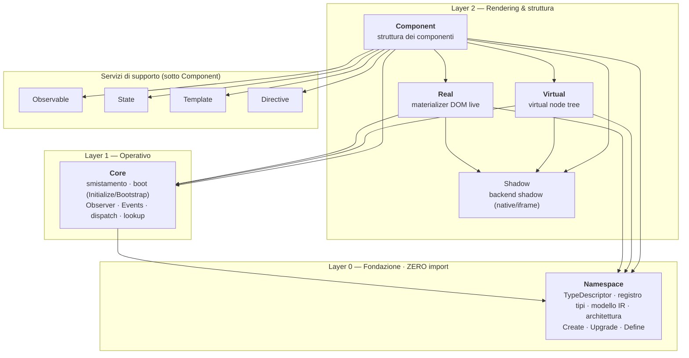
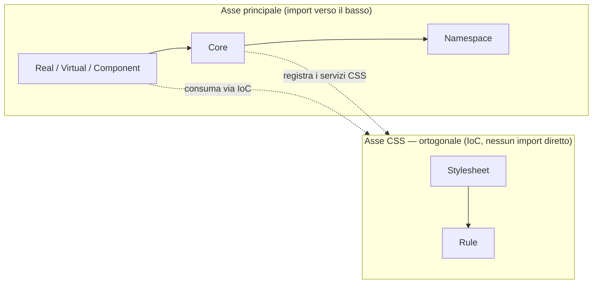

# AriannA JS — Architettura (target v2)

> Principio cardine: **le dipendenze puntano verso il basso, mai in su, mai in cerchio.**
> `Namespace` è la radice dei dati e dell'architettura e **non importa nulla**.
> `Core` è lo strato *operativo* che importa `Namespace` e smista. Tutto il resto
> sta sopra. `Rule`/`Stylesheet` sono **ortogonali** e si iniettano via IoC.

---

## 1. I quattro pilastri

| Pilastro | Cos'è | Dove vive |
|----------|-------|-----------|
| **Namespace** | Vocabolario + registro tipi + modello IR + architettura | `Core.ts` |
| **Type** | Descrittore `tag ↔ Interface ↔ Base ↔ Factory` (`TypeDescriptor`) | dentro `Namespace` |
| **Node** | Albero IR serializzabile (materializzato da Real/Virtual) | modello in `Namespace`, runtime in `Real`/`Virtual` |
| **Style** | AST CSS completo (declarations + rules + at-rule: media/supports/keyframes/…) | `Rule` + `Stylesheet` (ortogonali) |

La **reattività** (Expression/Binding/Signal) non è un pilastro strutturale: è un
asse trasversale che si *aggancia* al Node (Bindings/Events), fornito da
`Observable`/`State`.

---

## 2. Grafo delle dipendenze (aciclico)



Tutto il Layer 2 ruota attorno a **`Namespace.Create` / `Namespace.Upgrade` /
`Namespace.Define`**: Core le espone/smista, Real e Virtual le invocano per
materializzare, Component ci costruisce sopra la struttura del componente.

---

## 3. Matrice degli import

| Modulo | Importa |
|--------|---------|
| **Namespace** | — *(niente: è la radice)* |
| **Core** | `Namespace` |
| **Real** | `Core`, `Namespace`, `Shadow` |
| **Virtual** | `Core`, `Namespace`, `Shadow` |
| **Component** | `Core`, `Namespace`, `Shadow`, `Observable`, `State`, `Template`, `Directive`, `Real`, `Virtual` |
| **Rule** | — *(ortogonale, vedi §5)* |
| **Stylesheet** | — *(ortogonale; può comporre `Rule`)* |

Regola d'oro: se un modulo X importa Y, Y **non** può importare X (né direttamente
né per transitività). `Namespace` non importa nulla, quindi non può mai chiudere un
ciclo.

---

## 4. Responsabilità per modulo

- **Namespace** — unica fonte dei *dati*. Possiede `TypeDescriptor` e
  `NamespaceDescriptor`, il registro dei tipi (`tag ↔ Interface ↔ Base ↔ Factory`),
  il modello/schema **IR**, e i vocabolari (`html`, `svg`, `mathml`, `arianna`,
  custom). Espone le operazioni sul *proprio* registro: `Create`, `Upgrade`,
  `Define`. Nessun import → testabile in isolamento, serializzabile, è la spec
  vivente dell'IR.
- **Core** — strato *operativo / di smistamento*. Importa `Namespace` e fornisce:
  API pubblica, boot a due fasi (`Initialize` → buffering, `Bootstrap` → live),
  `Observer` (lifecycle via MutationObserver), bus `Events`, `GetDescriptor`/lookup,
  e il dispatch verso `Namespace.Define/Create/Upgrade`. Non possiede logica-dati
  propria: elabora e collega.
- **Real** — materializer del DOM *live*: IR Node → DOM, patch/diff, splice
  prototype. Importa Core/Namespace/Shadow.
- **Virtual** — albero di *virtual node* (stessa API di Real, internals diversi).
  Importa Core/Namespace/Shadow.
- **Component** — genera la **struttura** dei componenti: facilities, `build()`,
  lifecycle, shadow gating, sheet di classe. È il modulo più "in alto": importa
  anche Observable/State (reattività), Template/Directive (template+direttive) e
  Real/Virtual (le due viste).
- **Shadow** — backend shadow DOM (native + iframe-emulato), condiviso dal Layer 2.
- **Observable / State** — primitive reattive (signal/effect, store).
- **Template / Directive** — template e direttive.

---

## 5. Asse ortogonale: Rule / Stylesheet (IoC)

`Rule` e `Stylesheet` **non stanno nella catena di import** del Layer 0-2. Sono un
asse a sé: forniscono i servizi CSS (AST Style, serialize, emit del `<style>`,
apply su elemento/shadow) che oggi le altre classi implementano/richiamano *in
locale*, e li espongono come **servizi iniettabili (IoC)**.



**Perché IoC e non import diretti:**
1. **Niente cicli** — se Real/Component/Stylesheet si importassero a vicenda per il
   CSS, si chiuderebbero anelli. Con un'interfaccia registrata su un boundary stabile
   (es. un registry su Core) il CSS si consuma senza dipendenze dirette.
2. **Niente loop di chiamate sullo stack** — oggi più punti chiamano `Stylesheet`
   che può rientrare → rischio ricorsione/overflow. Un servizio iniettato e invocato
   attraverso un confine unico spezza il rientro.
3. **Un solo path di emit** — centralizzare serialize/emit/apply elimina lo split
   "globale-only vs inline" (la causa del bug Rule/Stylesheet) e fa dimagrire il
   codice duplicato nelle altre classi.

---

## 6. Kernel minimo

Il kernel è ciò che serve a registrare un Type in un Namespace, materializzare/
patchare un Node su DOM con binding reattivi, e applicare Style:

```
Namespace  (dati + registro + Create/Upgrade/Define)
   +
Core       (operativo: boot, Observer, Events, dispatch)
   +
Real       (materializer IR→DOM)
   +
Signal/Effect   (primitiva reattiva minima — da Observable)
   +
Rule/Stylesheet (CSS, via IoC)
```

Fuori dal kernel, tree-shakeable: Component, Virtual (se non usato), Template,
Directive, Shadow backends, Workers, SSR, Context, Plugin, Jsx, i namespace
non-`html`.

---

## 7. Note di migrazione (da oggi al target)

L'architettura attuale è l'**inverso** su un punto: oggi `Core.ts` possiede registro
+ `TypeDescriptor` + boot + Observer, e `Core.ts` **importa Core** (anche solo
per i tipi). Per arrivare al target:

1. **Spostare i tipi** `TypeDescriptor` e `NamespaceDescriptor` da `Core.ts` a
   `Core.ts`; Core li re-importa da Namespace.
2. **Spostare in Namespace** il registro tipi e `Define/Create/Upgrade` (gran parte
   è già lì); `Core` resta come dispatcher sottile + boot/Observer/Events.
3. **Rompere il ciclo** `Namespace → Core`: a fine migrazione Namespace non importa
   più nulla.
4. **Estrarre i servizi CSS**: oggi `Rule`/`Stylesheet` sono richiamati localmente in
   più moduli → definire un'interfaccia CSS e iniettarla (registrazione su un boundary
   di Core), rimuovendo gli import/uso diretti.
5. **A step, verificati in DOM reale.** Registro, Observer e boot vivono su stato
   module-scope: lo spostamento va fatto a piccoli passi, ricompilando e ri-testando
   nel playground a ogni passo (non solo transform/bundle: il DOM reale è l'unico
   giudice — lezione appresa).

> Stato bug aperti al momento della stesura: (1) costruttori `extends Component`,
> (2) Rule/Stylesheet rendering. Entrambi si chiudono *dentro* questa pulizia —
> (1) con un `Define` snello che lega la sottoclasse correttamente, (2) con l'applier
> Style unificato del §5. Vedi `MISSING_BUGS.md`.
